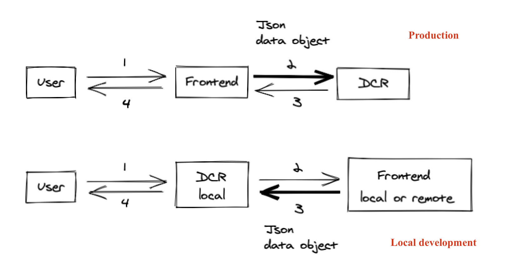

# Detailed setup guide

<!-- START doctoc generated TOC please keep comment here to allow auto update -->
<!-- DON'T EDIT THIS SECTION, INSTEAD RE-RUN doctoc TO UPDATE -->
<!-- Automatically created with yarn run createtoc and on push hook -->

-   [High level diagram](#high-level-diagram)
-   [Developing](#developing)
    -   [Setup](#setup)
    -   [Start](#start)
    -   [Previewing article on local](#previewing-article-on-local)
    -   [Previewing AMP on local](#previewing-amp-on-local)
    -   [Note on rebasing vs merging](#note-on-rebasing-vs-merging)
    -   [Debugging tools](#debugging-tools)
    -   [Running alongside identity](#running-alongside-identity)
-   [Production](#production)

<!-- END doctoc generated TOC please keep comment here to allow auto update -->

## High level diagram

This high level diagram shows the difference between the data flow when DCR is used in production, driven by the frontend backend, and when DCR is used as a local server. The arrows are labelled in the order they happen. The bold arrow is the JSON data object that DCR uses to generate the HTML document.



## Developing

### Setup

The only thing you need to make sure you have installed before you get going is Node.

We recommend [nvm](https://github.com/creationix/nvm) (especially combined with [this handy gist](https://gist.github.com/sndrs/5940e9e8a3f506b287233ed65365befb)). It is great at managing multiple versions of Node.js on one machine.

If you prefer to [install Node.js manually](https://nodejs.org),
check the [.nvmrc](https://github.com/guardian/dotcom-rendering/blob/main/.nvmrc) for the current required version.

That's it – everything else should be installed for you on demand.

### Start

Start the development server:

```bash
make dev
```

This will start the development server on port 3030: [http://localhost:3030](http://localhost:3030).

### Previewing article on local

You can preview an article from `theguardian.com` by appending the query string parameter `url` to your localhost article page. For example:

http://localhost:3030/Article?url=https://www.theguardian.com/world/2013/jun/09/edward-snowden-nsa-whistleblower-surveillance

You can use this technique to integrate with a locally running instance of `frontend`. This is especially useful for testing changes to the data model:

http://localhost:3030/Article?url=http://localhost:9000/world/2013/jun/09/edward-snowden-nsa-whistleblower-surveillance

### Previewing AMP on local

You can preview an AMP page similarly to an article, as follows

http://localhost:3030/AMPArticle?url=https://amp.theguardian.com/world/2013/jun/09/edward-snowden-nsa-whistleblower-surveillance

or, connecting to a locally running instance of frontend,

http://localhost:3030/AMPArticle?url=http://localhost:9000/world/2013/jun/09/edward-snowden-nsa-whistleblower-surveillance

### Note on rebasing vs merging

The dotcom-rendering github account is set up to merge PRs into main instead of rebase. Merge commits are useful to quickly revert things when there is a major incident - whereas with rebase you might have to revert a whole load of commits.

However, if you are working on a feature branch and plan to make a PR, it's still recommended to rebase on `main` to avoid extranous merge commits in branches.

### Debugging tools

For ease of development you may want to install:

-   [React Developer Tools](https://github.com/facebook/react-devtools)

### Running alongside identity

You may want local identity cookies to be available in `dotcom-rendering`. To enable this:

1. run `./scripts/nginx/setup.sh`
1. access `dotcom-rendering` through https://r.thegulocal.com

## Production

-   `make build` creates production-ready bundles.
-   `make start` starts the production server.

You may need to run these with `sudo`

The production port default is 9000 for deployment, but to run locally alongside frontend, you will need to manually override in `scripts/frontend/config.js`. To hit the server, add

```
rendering.endpoint = "http://localhost:${port}/Article"
```

with the overide port number to `frontend.conf` and run frontend locally.
